---
tags:
    - Diablo16
---

# 4Discovery-35

## Description

The 4Discovery is a high-resolution 480x320 pixel 3.5" Intelligent wall-mounted display product from 4D Systems, featuring the DIABLO16
Processor.

The 4Discovery is designed to be mounted to a standard light switch
flush/mounting box, or directly onto a panel or wall. This universal
mounting enables quick and easy installation almost anywhere, such as on a wall or into an enclosure or panel, enabling a wide range of
customers to take advantage of this display product.

Driving the display and peripherals is the DIABLO16 processor, a very
capable and powerful chip that enables stand-alone functionality,
programmed using the 4D Systems Workshop4 IDE Software. The Workshop
IDE enables graphic solutions to be constructed rapidly and with ease
due to its design being solely for 4D graphics processors.

The 4Discovery has an array of features including a 3.5" 320x480 TFT LCD
Display, Resistive Touch, micro-SD memory storage, 2 wire RS485
Interface that can act as Master or Slave with additional changeover
wire, and a switch-mode power supply enabling a wide input voltage
range, along with many more features.

Anything that has been designed to run on a PICASO or DIABLO16 module
can theoretically run on this 4Discovery with minor changes. Please ensure you contact the 4D Systems' support team if unsure about changing over from a 4D Systems module to this 4Discovery.

## Features {: class="page-break"}

- Powerful 3.5" Intelligent LCD-TFT display module powered by DIABLO16.
- 480x320 HVGA Resolution, RGB 65K true-to-life colours, TFT Screen
with integrated 4-wire Resistive Touch Panel.
- Programmed over RS485 using a special programmer designed
specifically for the 4Discovery.
- 6 banks of 32750 bytes of Flash memory for User Application Code and Data
- 32Kb of SRAM purely for the User.
- On-board micro-SD memory card connector for multimedia storage and
data logging purposes. HC memory card support is also available for
cards larger than 4GB.
- DOS-compatible file access (FAT16 format) as well as low-level access to microSD card memory.
- Display full colour images, animations, icons and video clips on
chosen 4D Systems display.
- Supports all available Windows fonts.
- 5.0V or 7.0V to 30V input voltage range operation (single supply).
- Module dimensions: 74.0 x 117.0 x 21.7mm
- Weight approximately 80g.
- Display Viewing Area: 48.96 x 73.44mm
- Easily mounted to the wall using a standard light switch
flush/mounting box, or can be mounted in an enclosure/panel or
virtually any flat drillable surface.
- Compatible with Clipsal/HPM mounting blocks, 18mm or thicker, if the
4Discovery needs to be offset from the wall (useful for concrete
block walls etc).
- RoHS and CE-Compliant

## RJ45 Pin Configuration and Summary {: class="page-break"}

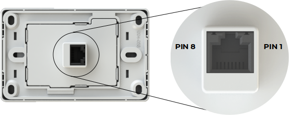{: class="width-50 pdf-width-80"}

| **Pin** | **Symbol** | **I/O** | **Description**                                       |
|:-------:|:----------:|:-------:|:------------------------------------------------------|
| 1       | VIN        | P       | 7.0V to 30VDC Input. Recommended range is 12V to 24V. This is the primary power source of the 4Discovery. |
| 2       | A          | I/O     | 485 A Signal (non-Inverting) pulled to 3.3V internally, terminated to B with 120Ω. |
| 3       | B          | I/O     | 485 B Signal (Inverting), pulled to GND internally, terminated to A with 120Ω.     |
| 4       | GND        | P       | System Ground, relevant to VIN and 5V_IN                               |
| 5       | GND        | P       | System Ground, relevant to VIN and 5V_IN                                        |
| 6       | 5V_IN      | P       | 5.0VDC Input. This is typically only used to power the 4Discovery from the 4D 485 Programmer, however, can be used to power the 4Discovery if a higher voltage power source into VIN is not available. Should be in the range of 4.5V to 5.5V, nominal 5.0V |
| 7       | TURN       | I       | Primarily used by the 4D 485 Programmer in conjunction with programming the 4Discovery, however, can also be from an external device that is acting as a Host when 4Discovery is programmed to be a slave. This is an input only to the 4Discovery. When 4Discovery is a Master, the slaves have to determine the direction of transmit/receive themselves using an Auto Turnaround 485 IC or circuit. |
| 8       | RESET      | I       | Reset signal used by the 4D 485 Programmer. Can be used by an external device if the 4Discovery needs to be reset. Active Low. |

!!! note

    **I** = Input, **O** = Output, **P** = Power

## Hardware Interface - Pins {: class="page-break"}

The 4Discovery provides both a hardware and software interface. This
section describes in detail the hardware interface pins of the device.

### Serial Ports - RS85

The 4Discovery provides one asynchronous serial port that interfaces via the RJ45 port and communicates using the RS485 protocol.

This serial port is used for both communications to various devices on
the RS485 bus, and also for the programming of the 4Discovery itself,
using the 4D 485 Programmer.

A MAX3430 RS485 IC is used inside the 4Discovery, to provide the RS485
interface, signals A and B.

The primary features are:

- Full-Duplex 8-bit data transmission and reception.
- Data format: 8 bits, No Parity, 1 Stop bit.
- Baud rates from 300 baud up to 250K baud.
- Single byte transmits and receives a fully buffered service. The
buffered service feature runs in the background capturing and
buffering serial data without the user application having to
constantly poll any of the serial ports. This frees up the
application to service other tasks.

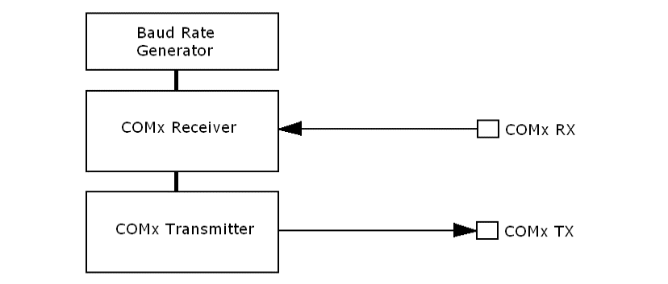{: class="width-50 pdf-width-65" }

A single-byte serial transmission consists of the start bit, 8 bits of
data followed by the stop bit. The start bit is always 0, while a stop
bit is always 1. The LSB (Least Significant Bit, Bit 0) is sent out
first following the start bit.

The figure below shows a single-byte transmission timing diagram.

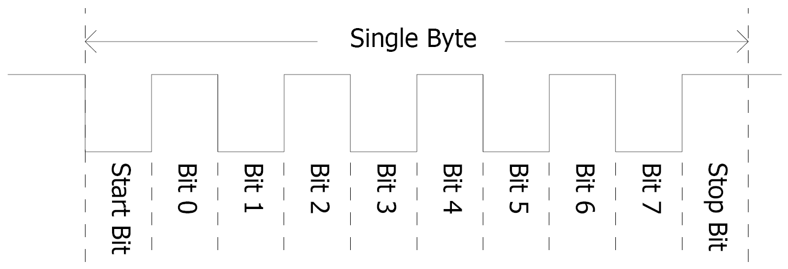{: class="width-55 pdf-width-60" }

### System Pins

**VIN (Primary Voltage Input):** _Pin 1_

:   4Discovery supply voltage input pin. This pin must be supplied between
    7.0VDC and 30VDC, and these must not be exceeded. Typical voltages are
    between 12V and 24VDC. If this pin is not used, a 5VDC source can be
    applied to pin 6 instead.

**A (485 A Signal):** _Pin 2_

:   This is the A signal used by the 2-wire RS485 bus on the 4Discovery.
    This signal is internally pulled up to 3.3V to prevent a floating bus and is terminated to the B signal with a 120Ω resistor.

**B (485 A Signal):** _Pin 3_

:   This is the B signal used by the 2-wire RS485 bus on the 4Discovery.
    This signal is internally pulled down to GND to prevent a floating bus and is terminated to the A signal with a 120Ω resistor.

**GND (Module Ground):** _Pins 4 and 5_

:   Device ground pins. At least one of these pins must be connected to the ground.

**5V_IN (Secondary Voltage Input):** _Pin 6_

:   4Discovery supply voltage input pin. This pin is typically used by the
    4D 485 Programmer when programming from the USB of a PC, however, it can also
    be used in the case a suitable voltage cannot be applied to VIN. Supply
    to his pin must be between 4.5V to 5.5V DC. The nominal operating voltage is
    5.0 Volts.

:   !!! note
        Backlight brightness will be lower for voltages under 5.0V.

**TURN (485 Turn Around Pin):** _Pin 7_

:   Primarily used by the 4D 485 Programmer in conjunction with programming the 4Discovery,
    however, can also be from an external device that is acting as Host when 4Discovery is programmed to be a slave.
    This is an input only to the 4Discovery. When 4Discovery is a Master, the slaves
    have to determine the direction of transmit/receive themselves using an
    Auto Turnaround 485 IC or circuit.

**RESET (Module Master Reset):** _Pin 8_

:   Reset signal used by the 4D 485 Programmer. This can be used by an
    external device if the 4Discovery needs to be reset. Active Low.

## PmmC/Firmware Programming

The 4Discovery features a 4D Systems DIABLO16 processor, which is a
custom graphics processor. All functionality including the high-level
commands is built into the chip. This chip-level configuration is
available as a PmmC (Personality-module-micro-Code) file, which can be
likened to traditional Firmware. There is also a Display Driver file,
which separates specific display settings from the PmmC.

A PmmC file contains all of the low-level micro-code information
(analogy of that of a soft silicon) which defines the characteristics and
functionality of the device. The ability to program the device with
a PmmC file provides an extremely flexible method of customising as well
as upgrading it with future enhancements.

The Display Driver contains the initialisation and parameters associated
with the particular display that is to be connected to the DIABLO16
processor. The PmmC file and Display Driver file can only be programmed into the
device using the RJ45 connector, using the 4D 485 Programmer with the
aid of Workshop4, the 4D Systems IDE software.

You must use the 4D 485 Programmer.
No other RS485 device will be able to program the 4Discovery.

## Module Features

The 4Discovery is designed to accommodate a range of wall or enclosure-mounted applications.
Some of the main features of the 4Discovery are listed below.

### Display - 3.5" TFT Touch Screen

The 4Discovery is equipped with a 3.5" TFT display. Details of the
display are listed below:

- Screen Size:
    - 3.5" diagonal
    - 320x480 resolution
    - 65K colours
- Integrated 4-Wire Resistive Touch Screen
- Viewing Area: 48.96 x 73.44mm
- Pixel Pitch: 0.153(H) x 0.153(V)mm
- Brightness: 220cd/m2

- Viewing Angle:
    - Above Centre: 65 degrees
    - Below Centre: 45 degrees
    - Left of Centre: 60 degrees
    - Right of Centre: 60 degrees
- Viewing Direction: 12 O'clock
- Contrast Ratio: 500:1
- 7 LEDs for Backlighting

!!! note

    The Displays used are the highest-rated 'Grade A' Displays,
    which allow for 0-4 defective pixels. A defective pixel could be solid
    Black (Dead), White, Red, Green or Blue.

### DIABLO16 Processor

The 4Discovery is designed around the DIABLO16 Graphics Controller from
4D-Labs.

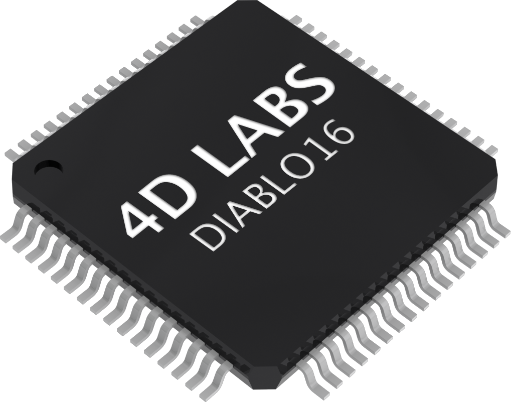{: class="width-25"}

The DIABLO16 is a smart Controller and the interface to the TFT- LCDs is almost plug-n-play.
All of the data and control signals are provided by the chip to interface directly with the display.

Powerful graphics, text, images, animation and countless more features
are built right inside the chip.

You can refer to the [DIABLO16 processor datasheet](./index.md) for more information.

### SD/SDHC Memory Cards

The 4Discovery supports micro-SD memory
cards via the onboard micro-SD connector. The memory card is used for all multimedia file retrieval such as images, animations and movie clips. The memory card can also be used as general-purpose storage for
data logging applications. Support is available for off-the-shelf micro-SD (up to 2GB) and high-capacity SDHC memory cards (4GB and above).

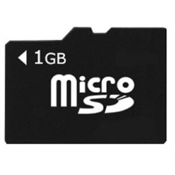{: class="width-25"}

!!! note

    A microSD card capable of SPI is a requirement for all 4D
    Systems' display modules powered by Goldelox, Picaso or Diablo16
    Processors. If a non-SPI compatible card is used, it will simply fail
    to mount or may cause intermittent issues resulting in lockups and
    crashing of the application. Please refer to the 4D Systems website
    for microSD cards offered by 4D Systems.

The micro-SD card can be used as an update medium for the 4Discovery, in
conjunction with suitable application code being written.
The MicroSD card can be mounted and used to update the application(s) stored on the
onboard Flash of Diablo16. This is useful to roll out updates without
having to reprogram the 4Discovery. This however is not able to update
the PmmC/Firmware or Display Driver. These must still be updated via the
RS485 Programmer or over the network with a suitable Host code.

The 4Discovery features a Card Detect on the microSD socket, which can
be utilised by the User in their application, to determine if a microSD
card is inserted or not.

**PA11** - Card Detect

: PA11 is Active Low when a card is detected, and High when no card is detected.

### FAT16

The uLCD-35DT Module uses off-the-shelf standard SDHC/SD/micro-SD memory
cards with up to 4GB capacity usable with FAT16 formatting. For any FAT file-related operations, before the memory card can be used it must
first be formatted with the FAT16 option. The formatting of the card can be
done on any PC system with a card reader. Select the appropriate drive
and choose the FAT16 (or just FAT in some systems) option when
formatting. The card is now ready to be used in the DIABLO16-based application.

The DIABLO16 Processor also supports high-capacity HC memory cards (4GB
and above). The available capacity of SD-HC cards varies according to
the way the card is partitioned and the commands used to access it.

The FAT partition is always first (if it exists) and can be up to the
maximum size permitted by FAT16. Windows 7 will format FAT16 up to 4GB.
Windows XP will format FAT16 up to 2GB and the Windows XP command prompt
will format FAT16 up to 4GB.

Partitioning of microSD cards should be carried out using the RMPET
tool, which is included with the Workshop4 IDE. This tool enables you to
partition and format your microSD card in a range of ways. It also
allows you to format the card so it is ready for the 4Discovery.

### Serial Flash Memory (Optional)

The 4Discovery features an optional 128Mbit (16MB) of Serial Flash
Memory which is connected to the following GPIO:

- **PA0** - SPI Chip Select
- **PA1** - SPI Clock
- **PA2** - SPI Data Out MOSI
- **PA3** - SPI Data In MISO

DIABLO16 has a set of built-in user functions to address SPI Flash
Memory.

For more information on the SPI functions, please refer to the
[Diablo16 Internal Functions Manual](../../manuals/4dgl/diablo16.md).

To order the 4Discovery-35 with Flash installed, please contact our Sales Team.

### Real-Time Clock (Optional)

The 4Discovery features an optional Microchip MCP7940N real-time clock.
This RTC is capable of Day, Month, Year, Hour, Minute, Seconds and Day
of Week, with leap year compensation up to the year 2399, and both 12 and 24-hour modes.

This RTC communicates to the DIABLO16 processor over an I2C interface
using the following GPIO:

- **PA13** - I2C Data SDA
- **PA12** - I2C Clock SCL

It is capable of up to 400 kHz I2C communications.
For more information on the I2C functions, please refer to the
[Diablo16 Internal Functions Manual](../../manuals/4dgl/diablo16.md).

To order the 4Discovery-35 with RTC installed, please contact our Sales Team.

### Crypto Authenticate (Optional)

4Discovery features an optional Atmel Crypto Authentication security
chip, which enables Diablo16 to encode messages securely so the messages
cannot be intercepted and read openly by a 3rd party without difficulty.

It also gives you the ability to have a unique ID for the 4Discovery, so
when using multiple on a BUS there is a hard-coded ID generated by the Crypto Authentication chip which is unique.

The Crypto Authentication chip uses the following GPIO:

- **PA14** - I2C Clock SCL

- **PA15** - I2C Data SDA

It is capable of up to 1 MHz I2C Communications.
For more information on the I2C functions, please refer to the
[Diablo16 Internal Functions Manual](../../manuals/4dgl/diablo16.md).

To order the 4Discovery-35 with Crypto Authentication installed, please contact our Sales Team.

### Piezo Buzzer

The 4Discovery has an onboard Piezo buzzer, which enables feedback to
the user for a range of situations, such as when the screen is touched,
or if an event occurs that needs an audio alert.

The Piezo buzzer uses the AUDIO pin on the Diablo16 processor and can
be controlled using the **snd_Freq()** function. The optimal frequency
to use for this buzzer is 2731Hz.

For more information on this function, please refer to the
[Diablo16 Internal Functions Manual](../../manuals/4dgl/diablo16.md).

### Universal Mounting Options

The 4Discovery has a range of ways it can be mounted. Primarily designed
to be mounted into a standard light switch frame (a.k.a. Flush Box,
Mounting Box), it can also be panel or enclosure mounted, or directly
mounted on virtually any supportive wall surface. This includes plasterboard, wood, and even concrete.

One nice feature about the 4Discovery is only a single central hole is
required to be drilled into the surface to enable the CAT5 cable to pass
through and the RJ45 socket on the back of the 4Disocvery to protrude
into. Mounting can then be as little as 2 screws, depending on the
mounting surface.

The central hole needs to be larger than 25mm (about 1") to
give the RJ45 socket sufficient clearance and not bind in the hole.

There are 4 corner mounting slots, designed for countersunk self-tapping wood screws or similar. 8G Countersunk Head chipboard screws work well.

There are 2 central mounting slots, designed for the Flush/Mounting box
which are commonly used for Plaster Board installations. Typically the
screws that come with the Flush/Mounting box are used and are Pan Head
type.

Any of these 6 mounting holes however can be used to mount the
4Discovery. Select the most appropriate ones for your target
installation, and ensure the 4Discovery is securely attached to the
surface in question.

Please refer to the mechanical drawing towards the end of this document,
for more information regarding the mounting holes and positions.

### Removable Front Cover {: class="page-break" }

The front cover of the 4Discovery is removable to access the
mounting holes beneath it. Simply clip on or unclip the cover as
required.

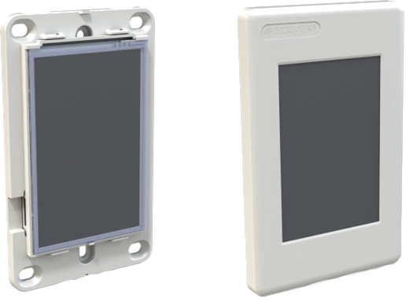{: class="width-30"}

On the front cover is a recessed area at the top left. This is
countersunk slightly into the surface and is designed so a company logo
sticker can be placed in this location, to customise the 4Discovery to
suit the application it is being used in. Bubble Stickers work well and
give a nice 3D look.

!!! note

    By default, starting with Revision 4.0, the plastics will be shipped without any branding in this area and a recess. Previous revisions featured 4Discovery branding in a recess which could then be covered.

    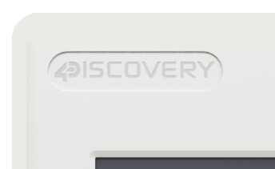{: class="width-30 pdf-width-20"}

### Removable Display subassembly

The display module itself can be removed from the mounting base, which
enables full access to all of the mounting holes, specifically the 2
central slots, designed for a Flush/Mounting box.

The display module can be carefully unclipped by gently raising the two
upper (or lower) clips, which will release the display module from the
mounting base. Please ensure only gentle force is applied to these clips so they are not
damaged.

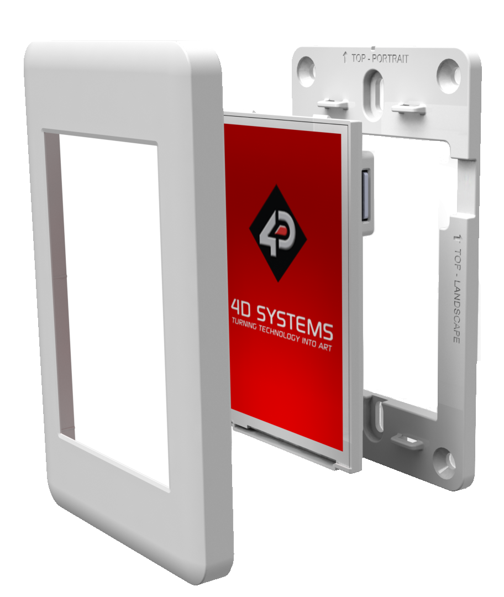{: class="width-30 pdf-width-25"}

## Display Precautions

- Avoid having to display the same image/object on the screen for lengthy periods. This will cause a burn-in which is a common
problem with all types of display technologies. Blank the screen
after a while or dim it very low by adjusting the contrast. Better
still; implement a screen saver feature.
- Moisture and water can damage the display. Moisture on the surface
of a powered display may cause the electrodes to corrode. Wipe off
any moisture gently or let the display dry before usage.
- Dirt from fingerprint oil and fat can easily stain the surface of
the display. Gently wipe off any stains with a soft lint-free cloth.
- The performance of the display will degrade under high temperatures and humidity. Avoid such conditions when storing.
- Displays are susceptible to mechanical shock and any force exerted
on the module may result in deformed zebra stripes, a cracked
display cell and a broken backlight
- Always use the mounting holes on the 4Discovery when mounting the
4Discovery to a wall, enclosure or panel.
- Do not apply undue tightness to the screws when fixing the
4Discovery to the chosen wall/enclosure, the 4Discovery case is made
of plastic and may be damaged if screws are fastened too tightly.

## Hardware Tools {: class="page-break" }

The following hardware tools are required for full control of the
4Discovery module.

### 4D 485 Programmer

The 4D 485 Programmer is an essential hardware tool to program,
customise and test the 4Discovery module.

It is possible to change the application the 4Discovery is running,
using a microSD card. This however is only possible once the 4Discovery
has been programmed such that the application can update itself.
This is not possible out of the box and requires an appropriate program
to be written to achieve this.

The 4D 485 Programmer is used to program a new Firmware/PmmC, Display
Driver and for transferring compiled Workshop4 Applications. It can even
serve as an interface for communicating serial data to the PC. The 4D
Programmer also supplies power to the 4Discovery so it can be programmed
on the bench or in the field, as it must be disconnected from the RS485 network to be programmed with the 4D 485 Programmer and
therefore needs a power source.

Connecting the 4D 485 Programmer to the 4Discovery, requires a standard
CAT5 Ethernet cable, straight through (NOT cross over). You can use
CAT4, CAT5, CAT5e, CAT6 etc. type cables, but all that is required is 8
wires/conductors and these are straight through, not crossed, to allow
correct connection between the two RJ45 plugs/connectors on the
4Discovery and the 4D 485 Programmer. The speed rating of Ethernet
cables is not relevant for the 4Discovery since it uses
RS485 which operates at a much slower speed than Ethernet.

The maximum length of cable between the 4Discovery and the 4D 485
Programmer, should be kept below 10m. This is due to TTL signals on the
RJ45 connector that need to be controlled by the 4D 485 Programmer.
Anything longer may be feasible depending on the type of cable used, however, typically longer cables will cause voltage drops and capacitive
loading which could cause programming to fail.

!!! note

    The 4Discovery cannot be programmed when connected to the
    RS485 network. It needs to be 1:1 with the 4D 485 Programmer.

## Programming Language {: class="page-break"}

The 4Discovery utilises the DIABLO16 processor, which belongs to a
family of processors powered by a highly optimised softcore virtual engine, EVE (Extensible Virtual Engine).

EVE is a proprietary, high-performance virtual machine with an extensive
byte-code instruction set optimised to execute compiled 4DGL programs.
4DGL (4D Graphics Language) was specifically developed from the ground up for the EVE engine core. It is a high-level language that is easy to
learn and simple to understand yet powerful enough to tackle many
embedded graphics applications.

4DGL is a graphics-oriented language that allows rapid application
development, and the syntax structure was designed using elements of
popular languages such as C, Basic, Pascal and others.

Programmers familiar with these languages will feel right at home with
4DGL. It includes many familiar instructions such as ``IF..ELSE..ENDIF,
WHILE..WEND, REPEAT..UNTIL, GOSUB..ENDSUB, GOTO, PRINT`` as well as some
specialised instructions ``SERIN, SEROUT, GFX_LINE, GFX_CIRCLE`` and many
more.

For detailed information about the 4DGL language, please refer
to the following documents:

- [4DGL Programmers Reference Manual](../../manuals/4dgl/index.md)
- [Diablo16 Internal Functions Manual](../../manuals/4dgl/diablo16.md)

To assist with the development of 4DGL applications, the Workshop4 IDE
combines a full-featured editor, a compiler, a linker and a downloader
into a single PC-based application. It's all you need to code, test and
run your applications.

4DGL is available to be written in two of the four environments offered
by the Workshop4 IDE, Designer and ViSi. The other two environments,
Serial and ViSi-Genie do not directly use 4DGL by the User (Except in
Workshop4 Pro, for ViSi-Genie), however, it is present in the background.
Serial is an application that runs, and that is written in 4DGL.
ViSi-Genie automatically generates 4DGL itself based on what is
configured in the GUI.

## Workshop4 IDE {: class="page-break"}

Workshop4 is a comprehensive software IDE that provides an integrated
software development platform for all of the 4D family of processors and
modules. The IDE combines the Editor, Compiler, Linker and Down-Loader to develop complete 4DGL application code. All user application code is
developed within the Workshop4 IDE.

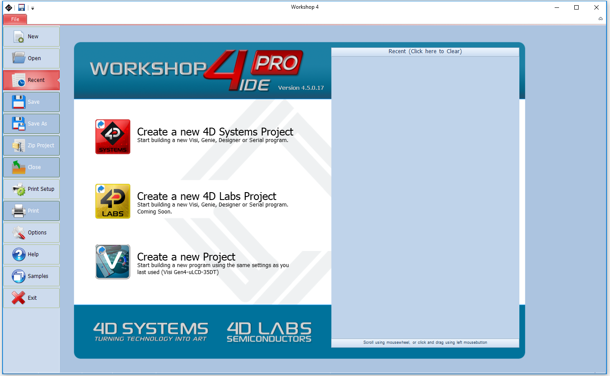{: class="pdf-width-75" }

The Workshop4 IDE supports multiple development environments for the
user, to cater to different user requirements and skill levels.

- The **Designer** environment enables the user to write 4DGL code in
its natural form to program the 4D display module.
- A visual programming experience, suitably called **ViSi**, enables
drag-and-drop type placement of objects to assist with 4DGL code
generation and allows the user to visualise how the display will
look while being developed.
- An advanced environment called **ViSi-Genie** doesn't require any
4DGL coding at all, it is all done automatically for you. Simply lay
the display out with the objects you want, set the events to drive
them and the code is written for you automatically. ViSi-Genie
provides the latest rapid development experience from 4D Systems.
- A **Serial** environment is also provided to transform the display
module into a slave serial module, allowing the user to control the
display from any host micro-controller or device with a serial port.

For more information regarding these environments, refer to the [Workshop4 manuals](../../manuals/workshop4/index.md).

The Workshop 4 IDE is available from the [4D Systems website](https://www.4dsystems.com.au).

### ViSi-Genie Limitations with 4Discovery

While the 4Discovery is capable of being programmed using the basic ViSi-Genie Environment, some limitations need to be observed. If the 4Discovery is being programmed as a Slave Device on the RS485 network, it can only function in Polled mode, rather than Event mode due to the RS485 interface being half-duplex rather than a full duplex. 2-wire RS485 is only half duplex. If the 4Discovery is being programmed as a Master Device (Host) on the RS485 network, it can operate using Event mode, however, is limited in data that can be returned from the slaves.

When the 4Discovery is used with the basic ViSi-Genie, only a single Master/Host and a single Slave can be present on the network. This is the limitation with the ViSi-Genie protocol, as there is no way to direct the ViSi-Genie protocol to a specific Slave, and there is no way for Half Duplex RS485 to handle the responses from the slaves. If more than 1:1 is required, another Environment such as ViSi will be required.

If the basic ViSi-Genie is to be used when operating as a Slave Device, which is the typical operation for a 4D display using ViSi-Genie, when selecting the Event options on any given widget/object, “Reported Messages” cannot be used. The Host must poll each object on the 4Discovery to gain the required information. 4Discovery cannot just send information when it likes, which is the case of Reported Messages, as the 4Discovery is a Slave and therefore is only allowed to speak when spoken to.

If the basic ViSi-Genie is to be used when operating as a Host Device, the Reported Message option can be used as it can speak out to the bus as required since it is the Master of the RS485 bus. However, it is not possible to request information from Slave devices, such as the value of something, as there are no standard functions available in ViSi-Genie to request data from another device. This mode is typically only useful if the 4Discovery only features controls such as buttons, switches, sliders and knobs, which do not require data to be displayed, and only send data out to the slaves for them to do a specific function. Therefore, it has limited but still applicable applications.

Workshop4 PRO has an advanced ViSi-Genie environment with new widgets that allow 4DGL code to be executed by the ViSi-Genie environment when various situations occur, such as button presses, data being received, touchscreen interaction, etc. With Workshop4 PRO, a number of the above limitations are lifted and therefore possible.

4D Systems has ViSi-Genie libraries for the Arduino and the Raspberry Pi. The Arduino library has been updated to include support for the 4Discovery, to allow it to communicate as a Slave to an Arduino using RS485 (external hardware is required on the Arduino). It utilises the Turn-Around pin on the 4Discovery to control the Transmit/Receive functionality of the RS485 transceiver. This Turn Around Pin control is required as the ViSi-Genie Protocol is defined already and therefore control of the 4Discoverys Transmit/Receive mode needs to be controlled from the Host, the Arduino. ViSi-Genie can be used with other hosts, however, these are the 2 platforms we have libraries written for.

## Connecting to External Hardware

The 4Discovery is capable of acting as both an RS485 Host, and
an RS485 Slave when appropriate circuitry is present on the devices being
interfaced to, and appropriate software is written. It is also possible
to connect multiple 4Discoveries onto a single bus at the same time.
Like all Half Duplex RS485 systems though, there can only be 1 Master.
All devices on the RS485 bus **MUST** communicate using the same
protocol else the system will not work.

### Master and Slaves

The 4Discovery is a Half-Duplex RS485 device, which means it operates on a 2-wire RS485 bus and there can be only a single Master device, and multiple Slave devices. Only the Master can initiate
communication, and a Slave can only communicate if first spoken to. Only 1 device can talk on the bus at any given time.

The simplest way to achieve this is when building a new network, and
each device on the network is programmable and capable of handling a
customised protocol. With an appropriate protocol, the Master can
initiate communication to one or all slaves at once (a Broadcast), and the
Slaves will receive the information, process it and based on which slave
the message was intended for, that Slave will reply with the information
requested or an Acknowledgement of an Action taken place. In the case of
a Broadcast, the Slaves should not attempt to reply at all, as only one
device can reply at once and this could lead to chaos on the network
(Unless an innovative protocol is derived).

If you are placing a 4Discovery into an existing RS485 system, the 4Discovery must be a Slave device to an existing
Master, and an existing Protocol must be programmed into the 4Discovery.

<figure markdown>
  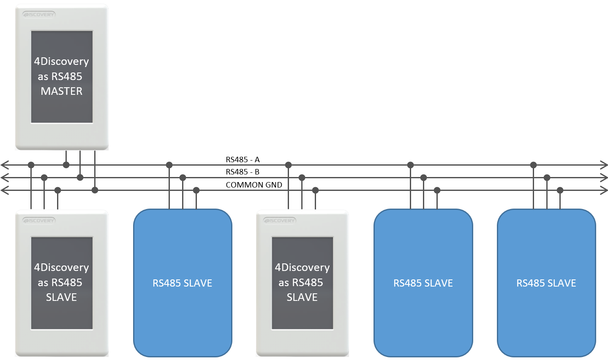{: class="width-75"}
  <figcaption>Figure 1: Typical 2-wire RS485 configuration, which includes a common ground</figcaption>
</figure>

On the 4Discovery, there is a Turn Around pin wired directly
to the RS485 transceiver, which switches the system
from Transmit to Receive. This pin is also connected to a GPIO of the Diablo16 processor and is capable of being controlled by the
4Discovery to tell other devices the state of the transmit/receive on
the 4Discovery.

While many use cases won't utilise the Turn Around pin, it is useful for those special systems where Automatic
Direction Control is not possible, such as if an existing protocol does
not support it, but the control of a GPIO is possible.

### 4Discovery as a Host

The 4Discovery is capable of being the Master device of the RS485 network. Therefore, it needs to communicate with all Slave devices on the network and handle the replies from each of them.

The 4Discovery is fully programmable by the User when used in Designer
or ViSi, and therefore every aspect of the system needs to be managed by
User Code. To enable the 4Discovery to transmit out of the RS485, the
Turn Around pin needs to be High, which is controlled using the PA10
GPIO on the Diablo16 processor on board the 4Discovery. To enable the
4Discovery to receive over RS485, the Turn Around pin needs to be Low.

<figure markdown>
  {: class="width-75"}
  <figcaption>
  Figure 2: This shows a 4Discovery as the Master of the RS485 Bus,
and there are multiple Slaves, which can include multiple 4Discoverys
(as Slaves).
</figcaption>
</figure>

As mentioned in [Master and Slaves](#master-and-slaves), the 4Discovery is capable of
being used in new RS485 systems, as well as existing systems. When used
in new systems, the 4Discovery protocol can be more easily customised to
provide the best mix of features and performance possible, compared
to existing systems which typically have a protocol already defined or devices that use a fixed protocol. The 4Discovery is fully programmable
so is capable of working with a large range of new and existing systems,
even if the protocols are specialised. The main factor is that all devices
on the RS485 bus need to take the same protocol, or else the system will
not operate correctly.

If there are systems that are not capable of determining when the
Slaves are 'allowed' to Transmit, the Turn Around pin may be used from
the 4Discovery to indicate when the Master (4Discovery) is transmitting or receiving and may be useful to assist the Slave.

The Master could communicate to each of the Slaves
individually, or all of them by doing a Broadcast, however, this is
dictated by the User Protocol and how the system is set up.

Each Device on the bus needs to communicate using the same protocol, and
each device must be able to control its own Transmit/Receive mode or
its RS485 transceiver.

### 4Discovery as a Slave

To operate the 4Discovery as an RS485 Slave, the same considerations need
to be made regarding the protocol used in the system, as when the
4Discovery was the Host. An appropriate Protocol is required such that
the Master Device transmits out onto the bus to the slaves, either
pinpointing a single Slave device or broadcasting to all Slave devices
on the Bus. Based on the Protocol, the Slaves will receive the message
and if the message is not intended for them, then discard it. If the
message is intended for them then wait for the end of the message and
reply accordingly.

The 4Discovery is not capable of Auto Direction Control and therefore
needs to be either externally controlled by the host (as is the case
when the 4Discovery is programmed using the 4D RS485 Programmer), or
more commonly the 4Discovery would handle the Direction Control of its
RS485 transceiver based on the data received on the RS485, dictated by
the Protocol.

The PA10 GPIO on the 4Discovery is connected to the Turn Around pin on
the RJ45 Jack, and it is also connected to the Transmit/Receive controls
of its RS485 transceiver. When the 4Discovery is in Slave Mode, the GPIO
needs to be controlled based on the data received over the RS485, to
place the 4Discovery in the appropriate Transmit or Receive state based
on the information received, dictated by the Users protocol.

If this is not possible, the Turn Around pin can be controlled by the Host to manually change the 4Discovery from being in Transmit or Receive
mode, however, this is less desirable and should only be used in special
situations. For example, if the 4Discovery is a Slave and the PA10 GPIO
is Low, then the Host is currently in Transmit mode, and data could be
flowing over the RS485 and should therefore be captured and processed.
If the PA10 GPIO is High, then the 4Discovery has the opportunity to
reply or send information to the Host if required, in response to the
previous data received.

When multiple devices are on the bus, i.e. more than 1 slave, Designer or
ViSi Environments can be used to program the 4Discovery as a Slave. If
only a single slave exists and no more are going to be added, ViSi-Genie
can be used.
Please refer to [ViSi-Genie Limitations with 4Discovery](#visi-genie-limitations-with-4discovery) for more information.

<figure markdown>
  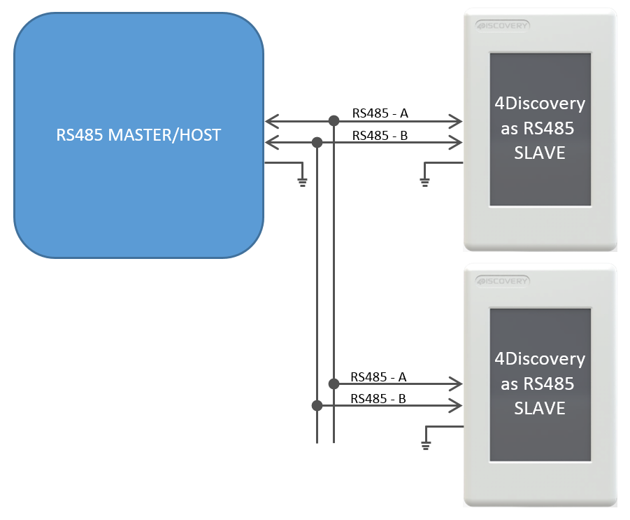{: class="width-75"}
  <figcaption>
  Figure 3: This shows a situation where there are 1 or more Slaves
on the network, of which 1 or more could be a 4Discovery.
</figcaption>
</figure>

Each Slave needs to handle the changing of its own Transmit/Receive, based on the
information received from the Master. Only one Slave should reply at any given
time after the Master has transmitted to it. Utilizing RS485
transceivers with Auto Direction control can simplify the setup,
however, a suitable protocol needs to be utilized regardless.

### 4Discovery Multiple Masters {: class="page-break" }

It is possible to implement a system that has multiple Master devices
on the RS485 network, provided the protocol is written to support this.

There may be situations where multiple 4Discoveries are required in a
building, all attached to the same RS485 network, and talk to the same
Slaves. While this is not a typical situation in the eyes of RS485, it
is possible to do so if each of the devices on the RS485 can be programmed
to handle this. The protocol programmed into the devices needs to be
written such that all devices are in Receiving Mode by default, and only
go into Transmit Mode when they are initiating a transmission. This will
allow any of the 4Discoveries working as Masters to send out a message to the bus, to be received by the other units.

As with any 2-wire RS485 network, only one Master can talk at any given
time. If a configuration is used where there are multiple Masters on the
same RS485 bus, the programming either needs to prevent multiple
Masters from speaking at the same time, or it needs to handle it if the situation
arises, such as if 2 Users are working on 4Discoveries in separate
locations, and are trying to send onto the bus at the same time.

<figure markdown>
  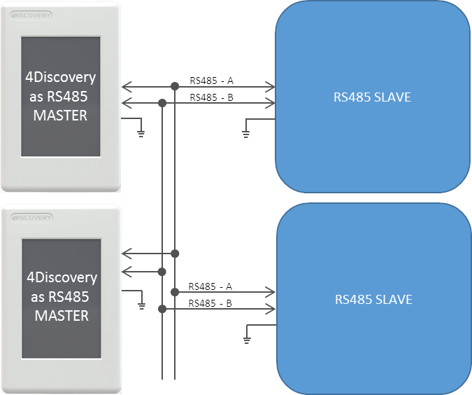{: class="width-75"}
  <figcaption>Figure 4: This shows multiple Masters on the RS485 network, with multiple Slaves</figcaption>
</figure>

A specialised program and protocol are required to
realise this setup but is useful if more than 1 4Discovery is required
on the network to control the same set of equipment from multiple
locations.

### Programming 4Discovery

The only method available to program the 4Discovery <u>directly</u>
is by using the 4D RS485 Programmer. This device
programs the 4Discovery over the RS485 bus, as well as supplying it
Power and controlling the Turn Around pin of the 4Discovery and the
Reset signal, to appropriately program the on-board Diablo16 Processor.

There is no other programmer which can be used to program the
4Discovery. The 4D RS485 Programmer is also capable of upgrading the
PmmC/Firmware of the 4Discovery and the Display Driver, along with the
User Application.

An alternative method of loading a new Application onto the 4Discovery
is by loading a pre-compiled program from microSD storage,
onto the onboard flash of the Diablo16 processor.
This can be done using the built-in functions of the Diablo16 processor and enables the 4Discovery
to be updated in the field by the End User, without having to have a
technician or technical person on call to program the 4Discovery using
the 4D RS485 Programmer and PC. This method however cannot be used to
upgrade the PmmC or Display Driver. This can only be done using the 4D
RS485 Programmer. To enable the loading of precompiled programs onto the
4Discovery from the microSD card, an appropriate application needs to be
written, this is not possible straight out of the box.

Here is a diagram to show the basics of how the 4Discovery interfaces with the 4D RS485 Programmer.

<figure markdown>
  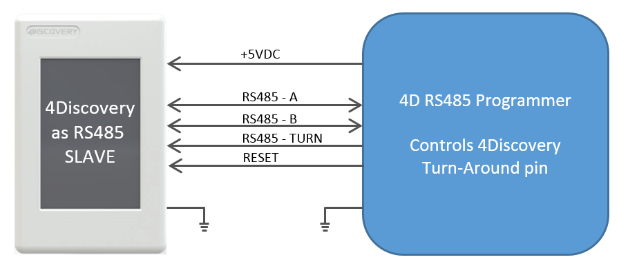{: class="width-75"}
  <figcaption>Figure 5: Programming the 4Discovery using the 4D RS485 Programmer.</figcaption>
</figure>

The Programmer controls the 4Discovery's
Turn Around Pin, allowing the programming software to dictate when the
4Discovery is listening and when it is allowed to reply to programming
commands. This same setup can be used for general communications also,
where there is one external Master and 4Discovery as a single Slave. It
is not possible to have multiple Slaves in this situation, due to the
way the Turn Around Pin is interfaced with the 4Discovery to make the 4Discovery programmable over the RJ45 connector using RS485.

Programming of the 4Discovery is only possible when the 4Discovery is
disconnected from the RS485 network and is connected 1:1 with the 4D
485 Programmer. It is not possible to program it when connected to the
network, as the Reset and Turn Around pins are required to program the
4Discovery, and other devices may try to communicate on the bus when
programming is occurring, which could cause corruption and the
programming to fail. Reset and Turn pins are also TTL level, so the
distance these should ideally be transmitted over should be as short as
possible. Please refer to [4D 485 Programmer](#4d-485-programmer), for more
information.

### Termination Resistors

On each 4Discovery is a built-in 120Ω termination resistor. This is
open/deactivated by default.

The termination resistor is there to absorb reflections in the RS-485
bus, however typically is only used at each end of the bus, i.e. the
first device and the last device. Depending on how you are configuring your
system with the 4Discovery, will determine if you need a termination
resistor or not. In several cases, having a termination resistor
present is better than not having a termination resistor at all, even if
the termination is not located at the end of the bus, however, this is
very subjective and system-dependent.

If the lack of on-board termination is causing problems with
communication, it can be enabled but requires the 4Discovery case to be
carefully opened and the PCB modified. On the back of the 4Discovery is
a cover, which is attached with multiple clips, and can be tricky to
remove. Using a plastic tool or possibly two plastic tools, these clips
can be carefully opened, and the back cover removed, exposing the
circuitry inside.

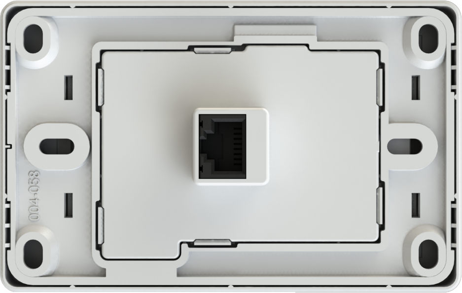{: class="width-30" }

Under the cover, towards the bottom, are two sets of pads with the label JP1.
These two pads need to have a solder blob added to connect them.
This will **enable** the 120Ω resistor. If the 120Ω
resistor needs to be disabled again, these pads can be unsoldered.

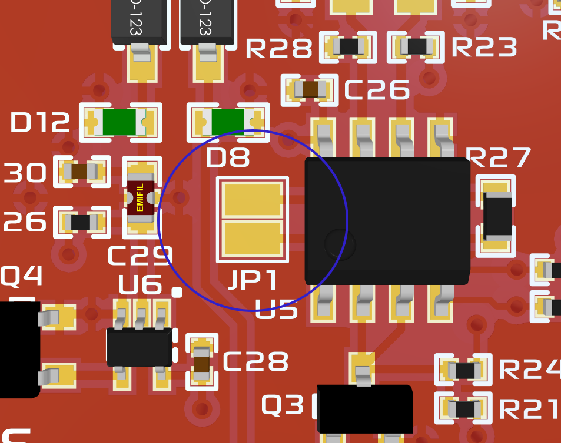{: class="width-30 pdf-width-25" }

!!! note

    Extreme care needs to be taken when performing this
    modification, as too much heat or a slip of the soldering iron could
    result in components/displays or tracks being damaged. This should only
    be attempted by people who know the risks and are capable of modifying
    the PCB.

## Mechanical Details

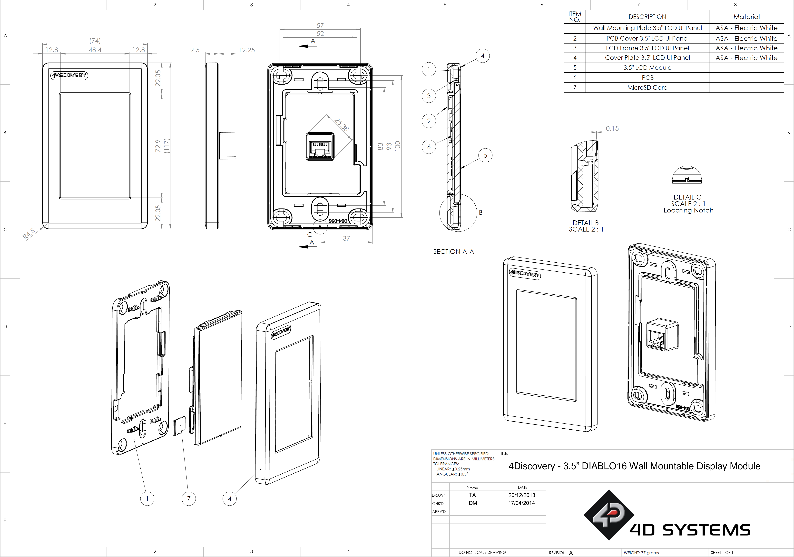{: class="less-height" }

## Schematic Details - HW REV 2.7

[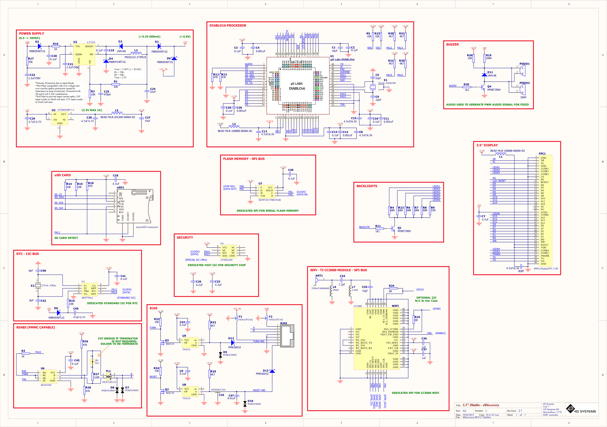{: class="less-height" }](../4Discovery-35/4Discovery-REV2.7.pdf)

## Schematic Details - HW REV 4.0

[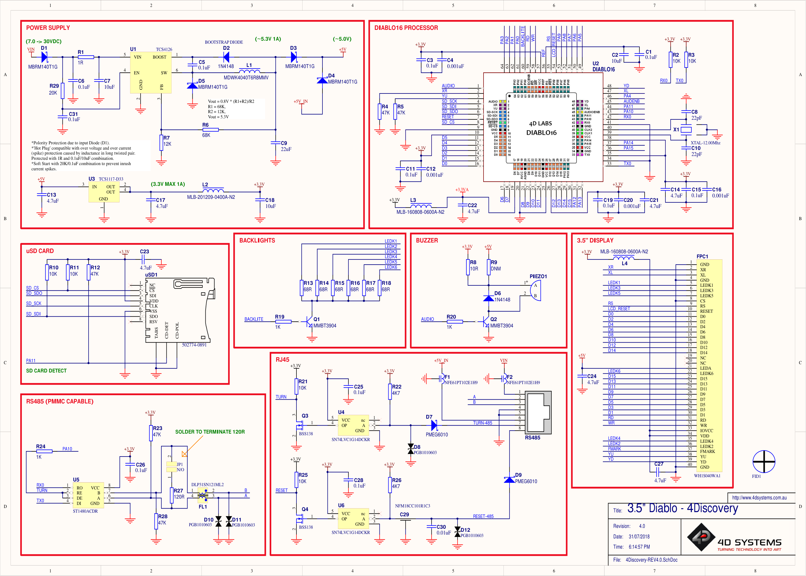{: class="less-height" }](../4Discovery-35/4Discovery-REV4.0.pdf)

## Schematic Details - HW REV 4.2

[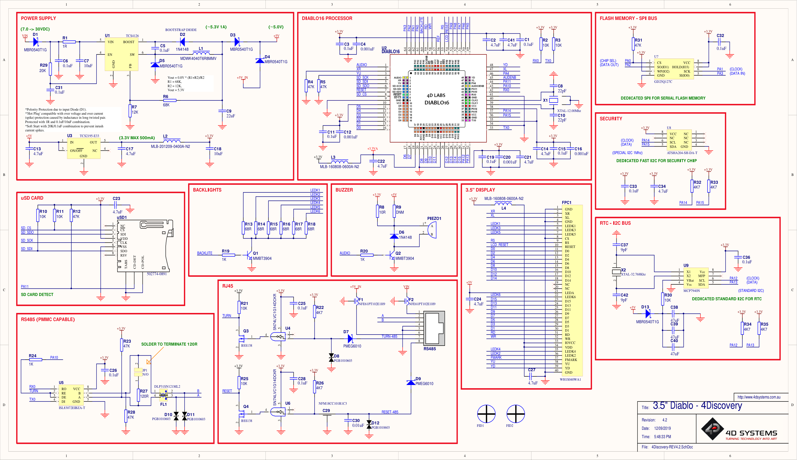{: class="less-height" }](../4Discovery-35/4Discovery-REV4.2.pdf)

## Specifications

!!! table "Absolute Maximum Ratings"

    |                                               |                       |
    |:----------------------------------------------|:----------------------|
    | Operating ambient temperature                 | -20°C to +70°C        |
    | Storage temperature                           | -30°C to +80°C        |
    | Voltage on VCC with respect to GND            | 7.0V to 30VDC         |
    |  Voltage on 5V_IN with respect to GND         | 4.5V to 5.5V          |

!!! note

    Stresses above those listed here may cause permanent damage to the device. This is for stress rating only and functional operation of the device at those or any other conditions above those indicated in the recommended operation listings of this specification is not implied. Exposure to maximum rating
    conditions for extended periods may affect device reliability. 

!!! table "Recommended Operating Conditions"

    | **Parameter**             | **Conditions**                   | **Min**  | **Typ** | **Max** | **Units** |
    |:--------------------------|:---------------------------------|:--------:|:-------:|:-------:|:---------:|
    | Supply Voltage (VCC)      | Stable external supply required  | 7.0      | 12.0    | 30.0    | V         |
    | Supply Voltage(5V_IN)     | Stable external supply required  | 4.5      | 5.0     | 5.5     | V         |
    | Operating Temperature     |                                  | -10      | --      | +60     | °C        |
    | Reset Pulse               | External Open Collector          | 20       | --      | --      | µs        |
    | Operational Delay         | Power-Up or External Reset       | 500      | --      | 5000    | ms        |
  
!!! table "Global Characteristics Based on Operating Conditions"

    | **Parameter**             | **Conditions**                   | **Min**  | **Typ** | **Max** | **Units** |
    |:--------------------------|:---------------------------------|:--------:|:-------:|:-------:|:---------:|
    | Supply Current (ICC)      | 12V, heavily depends on screen usage conditions, SD Card etc (REV 4.0) | 11 | 120 | -- | mA |
    |            | 5V, heavily depends on screen usage conditions, SD Card etc (REV 4.0) | 23 | 200 | -- | mA |
    | Diablo16 Flash Memory Endurance | PmmC / Application  Programming | --   | 1 0000    | --      | E/W    |
    | Diablo16 Memory Data Retention | Provided Maximum ratings are not exceeded | 20   | --  | -- | Years    |
    | Display Endurance         | Hours of operation, measured to when the display is 50% original brightness | -- | 20000 | -- | H |

## Revision History

!!! table "Hardware Revision"

    | **Revision Number** | **Date**     | **Description**                                                    |
    |:-------------------:|:------------:|:-------------------------------------------------------------------|
    | 2.7                 | 01/03/2015   | Limited Public Release                                             |
    | 4.0                 | 01/07/2018   | - Removal of CC3000 WiFi Module due to EOL   - Removal of Crypto Authentication IC   - Changing of some components from 0603 to 0402    - Removal of RTC and Flash IC |
    | 4.2                 | 29/05/2019   | - Addition of optional Crypto Authentication IC   - Addition of optional RTC    - Addition of optional Flash IC |

!!! table "Datasheet Revision"

    | **Revision Number** | **Date**     | **Description**                                                    |
    |:-------------------:|:------------:|:-------------------------------------------------------------------|
    | 2.0                 | 09/12/2015   | Initial Public Release Version                                     |
    | 2.1                 | 28/03/2019   | Cosmetic Changes and Formatting                                    |
    | 2.2                 | 09/12/2015   | Added discussions for Crypto Authentication IC, RTC and Flash IC   |
    | 2.3                 | 17/08/2020   | Fixed some mistakes and Formatting                                 |
    | 2.4                 | 14/12/2022   | Modified datasheet for web-based documentation                     |
    | 2.5                 | 28/08/2023   | Added Legal Notice and Product Image on Cover Page                 |
